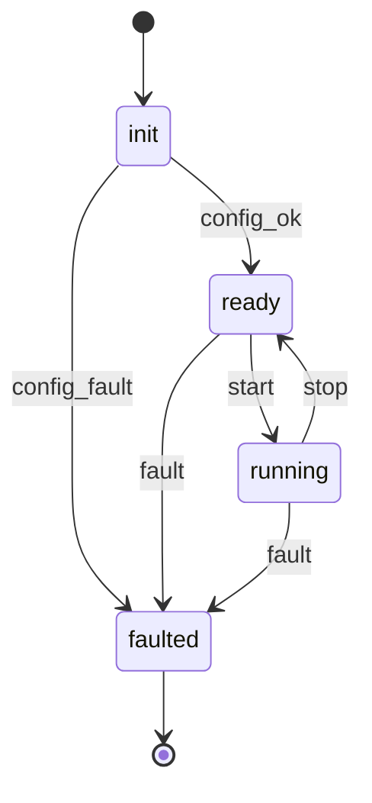
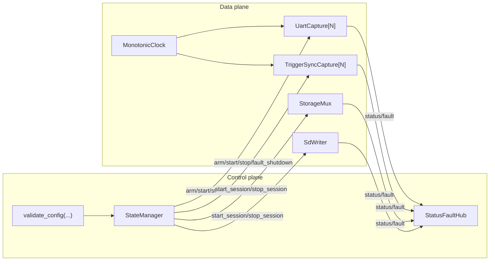
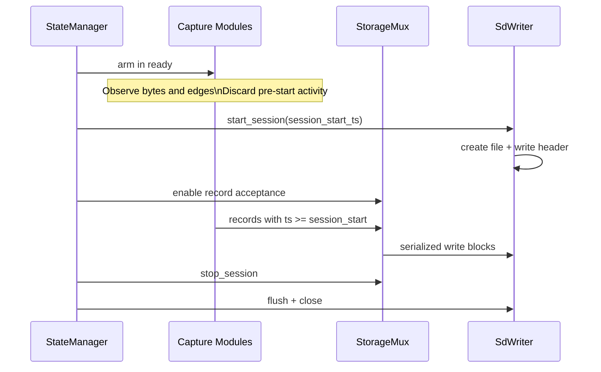
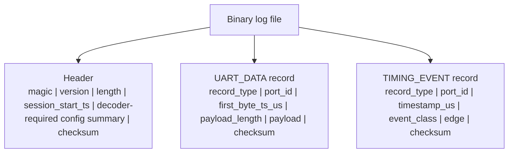
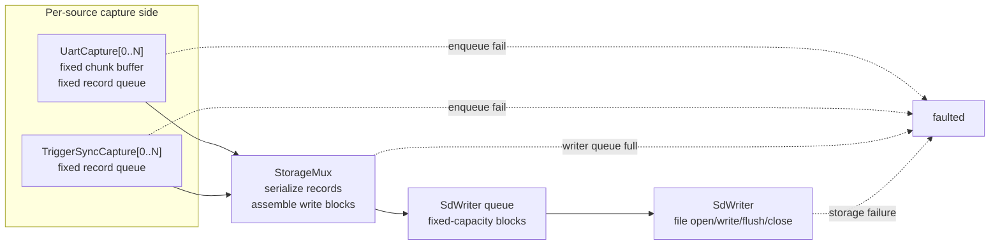

# DAQ V1 Design

## Overview

This document defines the first prototype design for the embedded data acquisition unit (DAQ) running on the ESP32-P4. The prototype must validate three goals together:

- capture all UART bytes and trigger/sync events reliably
- maintain microsecond-accurate timestamps for UART packet starts and timing events
- prove the basic control pipeline and state model are correct without overbuilding features

The device records UART traffic from up to four serial ports into a single binary log file on an SD card. The same log also contains trigger and sync timing events.

## V1 Constraints

- configuration is compile-time only
- UART packet timestamps represent first-byte arrival time
- UART chunking uses idle-gap flush with a fixed-size fallback
- sync records include edge information
- all data-path buffering is fixed-capacity and statically allocated
- any overflow or storage failure is irrecoverable and forces `faulted`
- all packets in the binary log must have timestamps greater than or equal to the session start time
- pre-start observations in `ready` are ignored rather than buffered
- the SD card log uses a normal filesystem file rather than raw block logging
- the file format is custom binary, not protobuf or nanopb

## State Model

The prototype uses four states:

- `init`
- `ready`
- `running`
- `faulted`

Transitions:

- `init -> ready` after compile-time configuration validates successfully
- `ready -> running` on start command
- `running -> ready` on stop command
- `* -> faulted` on any irrecoverable fault

The `faulted` state is terminal for v1.

## Plane Separation

The firmware is split into a data plane and a control plane with deliberately small interfaces.

### Data Plane

The data plane owns deterministic capture and persistence:

- UART capture per port
- trigger/sync capture per port
- per-source fixed buffers and source queues
- storage muxing and record serialization
- SD-card file writing
- shared monotonic microsecond timestamp service

### Control Plane

The control plane decides whether a session is active and records system health:

- state transitions
- startup configuration validation
- coarse commands to the data plane
- centralized status and fault reporting

The control plane must not sit in the hot path for byte capture, ISR timestamping, or file writes.

## Modules

### Data Plane Modules

#### `UartCapture[N]`

One instance per UART source.

Responsibilities:

- arm the UART receive path in `ready`
- observe incoming bytes without committing records before `start`
- timestamp the first byte of each chunk
- accumulate bytes until idle-gap timeout or max chunk size
- emit completed UART records into a fixed output queue

Non-responsibilities:

- state transitions
- filesystem access
- knowledge of other sources

#### `TriggerSyncCapture[N]`

One instance per associated trigger/sync source.

Responsibilities:

- arm trigger output and sync input timing capture in `ready`
- ignore pre-start events for file logging
- timestamp trigger events when the output pulse is issued
- timestamp sync events at the detected GPIO edge
- include event class and edge metadata in emitted records

#### `MonotonicClock`

Shared service that provides a common monotonic microsecond timebase used by all capture modules.

#### `StorageMux`

Responsibilities:

- consume records from all per-source queues
- serialize records into the binary file packet format
- assemble fixed write-ready blocks for the SD writer
- forward serialized blocks into the SD-writer queue

The storage mux does not touch the filesystem directly.

#### `SdWriter`

Responsibilities:

- create and own the session log file
- write the fixed file header first
- append serialized blocks during `running`
- flush and close on `stop`
- raise faults on open, write, flush, close, or session-lifecycle failures

The SD writer owns file lifecycle, not packet semantics.

### Control Plane Modules

#### `StateManager`

Single authority for global state.

Responsibilities:

- hold the current state
- validate state transitions
- receive coarse events such as `config_ok`, `start`, `stop`, and `fault`
- emit coarse commands such as `arm`, `start_session`, `stop_session`, and `fault_shutdown`

The state manager decides. It does not inspect raw captured data.

#### `validate_config(...)`

Pure helper function or small set of pure helper functions called during `init`.

Responsibilities:

- validate compile-time constants
- validate cross-field consistency
- return success or a specific fault reason

Representative checks:

- enabled UART count is within supported range
- chunk sizes fit static buffers
- idle-gap thresholds are sane
- queue capacities are valid

#### `StatusFaultHub`

Central sink for status and fault messages from all modules.

Responsibilities:

- collect debug and fault events
- preserve the reason for failures
- support later diagnostics

It is not part of the timing-critical path and capture must not depend on it.

## Session Semantics

The system is armed in `ready`, but the active recording session begins only on `start`.

Rules:

- `start` captures a session start timestamp
- only records with timestamps greater than or equal to the session start time are eligible for file logging
- any UART bytes or trigger/sync events observed before `start` are discarded
- `stop` ends record acceptance and closes the session cleanly

This makes the session boundary explicit and ensures the file contains only in-session data.

## Record Model

The binary log contains a file header followed by a sequence of records.

### UART Data Record

Fields:

- record type
- sensor or port ID
- first-byte timestamp in microseconds
- payload length
- payload bytes
- record checksum

Behavior:

- record creation is triggered by idle-gap timeout or max chunk size
- the timestamp remains the first-byte arrival time for the entire chunk

### Timing Event Record

Fields:

- record type
- sensor or port ID
- timestamp in microseconds
- event class: `trigger` or `sync`
- edge: `rising` or `falling` where applicable
- record checksum

Behavior:

- trigger timestamps correspond to output pulse issue time
- sync timestamps correspond to detected input-edge time

## File Format

The file format is a custom fixed binary format.

### Header

The file starts with a small fixed header written by `SdWriter`.

Header fields:

- magic bytes
- header version
- header length
- session start timestamp
- only those configuration summary fields that a specific offline decoder version requires
- header checksum

`header length` allows versioned parsers to determine where the header ends for any supported version, even if later versions add or remove optional metadata fields.

The format definition is shared by the data plane, but the physical act of writing the header belongs to `SdWriter`.

### Records

Records are fixed-schema binary packets defined by record type. The format remains intentionally narrow and explicit for v1. No nanopb or general serialization framework is used.

### Ordering

Records are written in the order `StorageMux` dequeues and serializes them. The firmware does not attempt to globally reorder records by timestamp at runtime.

Timestamps remain the source of truth for offline reconstruction.

## Queueing Model

The queueing model is strictly bounded and allocation-free in the hot path.

### Source Side

- each `UartCapture[N]` owns a fixed chunk buffer and a fixed output queue
- each `TriggerSyncCapture[N]` owns a fixed output queue
- completed records must enqueue immediately

### Storage Side

- `StorageMux` consumes source queues and produces fixed write blocks
- `SdWriter` consumes a single fixed queue of serialized write blocks

### Capacity Rule

If any source queue or the SD-writer queue cannot accept a record or block immediately, the system raises an irrecoverable fault. The design never silently drops data to preserve continued operation.

## Fault Handling

All runtime faults are irrecoverable in v1.

Representative fault sources:

- UART source queue overflow
- trigger/sync queue overflow
- SD-writer queue overflow
- file open failure
- file write or flush failure
- invalid internal record state
- invalid session lifecycle handling
- configuration validation failure

Any such condition raises a fault event and transitions the system into `faulted`.

## Verification Strategy

### Host-Side Verification

Host tests should cover:

- `validate_config(...)`
- state transition logic
- session boundary rules
- record serialization
- header serialization and checksum validation
- checksum verification helpers

### Hardware Verification

The mock test rig should verify:

- complete UART-byte capture across all enabled ports
- correct first-byte timestamp semantics under idle-gap chunking
- correct trigger and sync edge capture
- correct session boundaries with no pre-start or post-stop records
- fail-fast behavior when storage is intentionally stalled or removed

Timestamp accuracy is validated independently with a logic analyzer or oscilloscope.

## Explicit V1 Non-Goals

- runtime configuration loading
- silent degradation or lossy fallback modes
- in-firmware global record reordering by timestamp
- fault recovery without reset
- general-purpose serialization frameworks
- expanded metadata not required for immediate offline decoding
