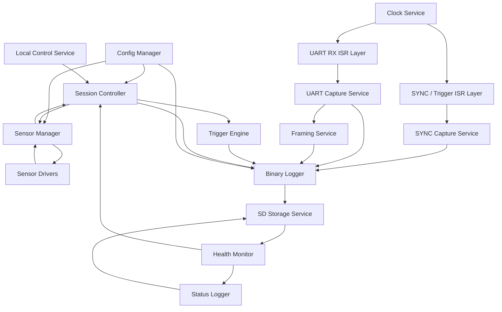

# Foundations
## ESP32-P4 Nano Robust UART Sensor Logger

This document covers the architectural purpose, design rules, system context, and the top-level software decomposition.

---

## Purpose

The software architecture defines how the logger firmware is organized so that:

- raw UART data is preserved reliably
- timing remains deterministic
- heterogeneous sensors can be prepared consistently before recording
- SD logging is authoritative
- optional features cannot endanger capture integrity

This architecture is implementation guidance, not source code.

---

## Architectural Principles

- raw UART bytes are captured before any interpretation
- no required capture path relies on software polling
- capture, timing, and storage are decoupled by explicit buffers and queues
- interrupt handlers do minimal work and never perform filesystem operations
- optional framing and diagnostics are isolated from real-time capture
- heterogeneous sensors share one normalized readiness contract before active recording can begin
- sensor-specific initialization runs before recording and never replaces raw-capture guarantees
- all detected loss conditions are surfaced explicitly
- ownership of every buffer and queue is single-writer or otherwise explicitly synchronized

---

## System Context

At runtime the firmware coordinates:

- 4 sensor UART receive paths
- per-port sensor initialization and readiness workflows
- 4 per-port SYNC lines configurable as input or trigger output
- one monotonic microsecond device clock
- one binary session log
- one human-readable status log
- local session control via button and console

Platform assumptions carried in from the design document:

- ESP32-P4 on the Waveshare `ESP32-P4-NANO` is the only active MCU in revision 1
- the onboard `ESP32-C6`, Ethernet, and USB OTG features remain out of scope
- the onboard TF slot is used in native `SDMMC` mode rather than SPI mode
- `UART0` remains reserved for console, flashing, and recovery during bring-up unless a later verified pin map requires a change

The SD card binary log is the system of record.

---

## High-Level Software Diagram

Interpretation:

- interrupts only capture time-sensitive events and move them into owned queues
- sensor preparation is a pre-recording control flow coordinated through `sensor_manager`
- services convert raw events into versioned log records
- storage is downstream of all capture paths
- optional framing consumes copied UART data and publishes metadata only
