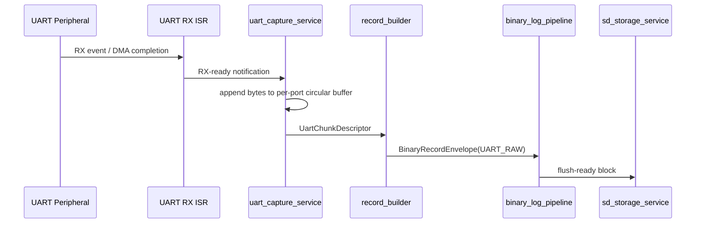
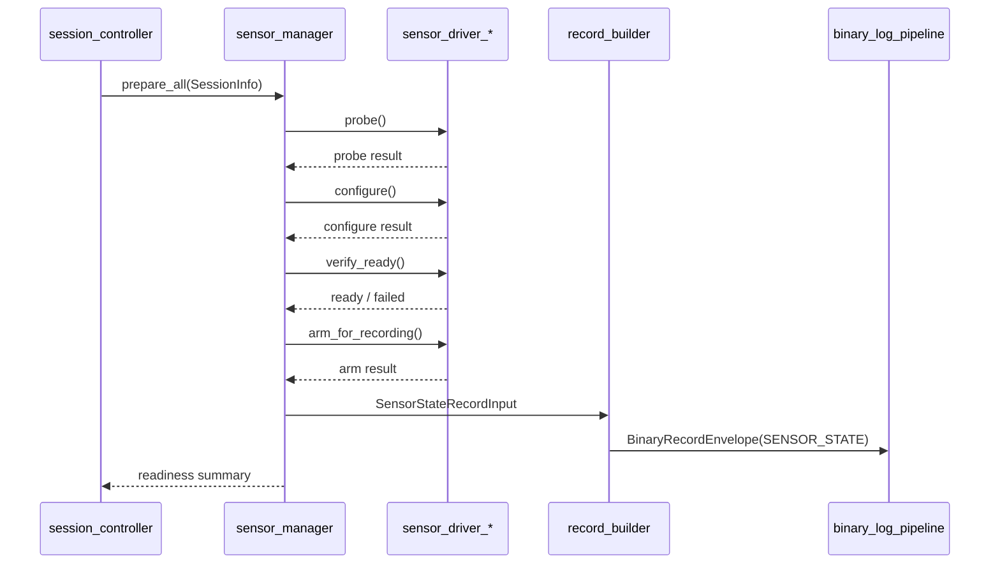
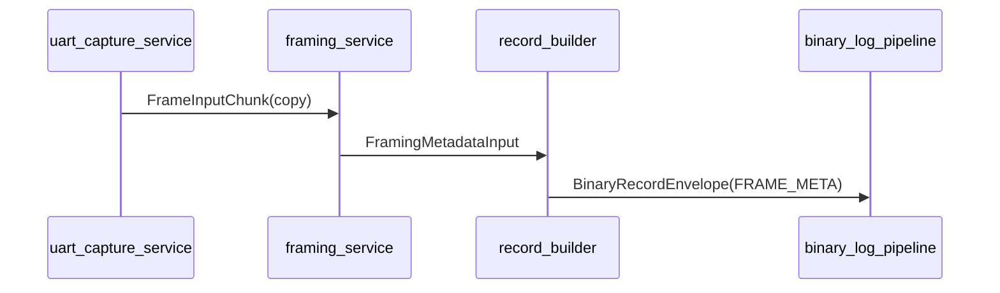
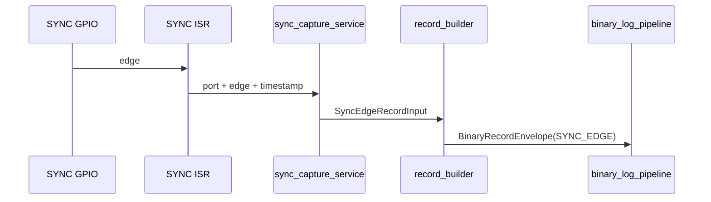
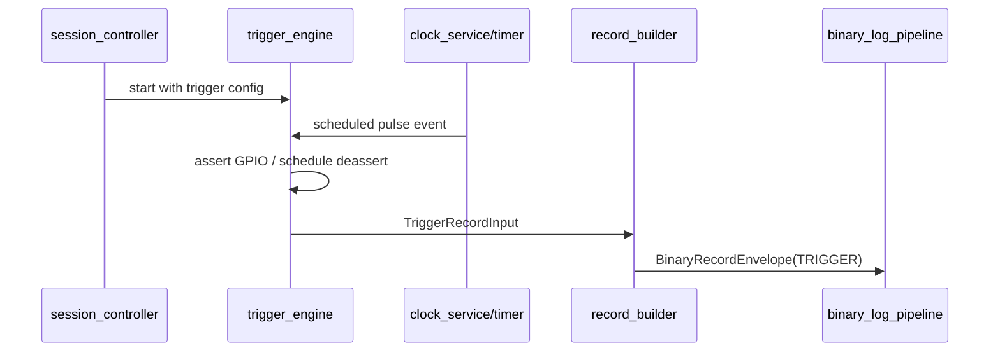
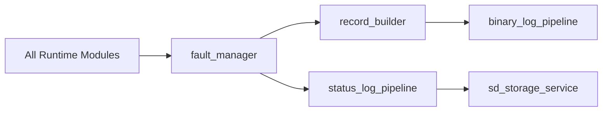

# Communication Pipelines
## End-To-End Flows Between Modules

---

## UART Data Pipeline

Guarantees:

- bytes enter a preallocated per-port buffer before optional processing
- record creation is downstream of capture buffering
- SD backpressure is absorbed by staging buffers until retention is exhausted

---

## Sensor Preparation Pipeline

Guarantees:

- heterogeneous sensor setup is normalized through one lifecycle contract
- failed required sensors block transition into active recording
- raw capture does not begin until preparation gating is complete

---

## Optional Framing Pipeline

Guarantees:

- framing consumes copies, not authoritative capture buffers
- raw logging remains valid if framing is disabled or overloaded

---

## SYNC Edge Pipeline

---

## Trigger Pipeline

---

## Fault And Status Pipeline

