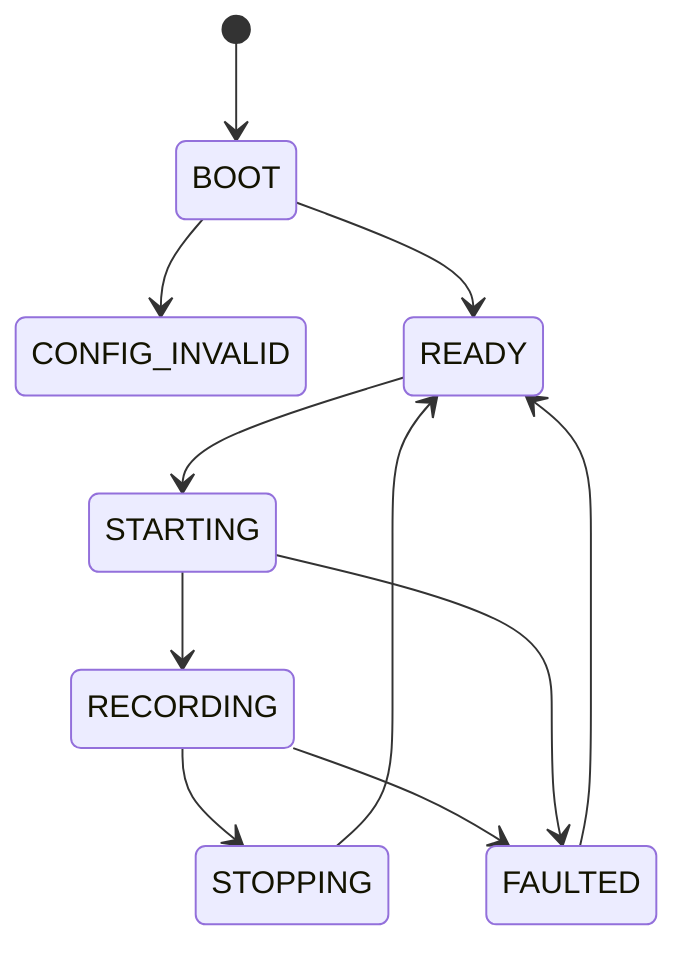
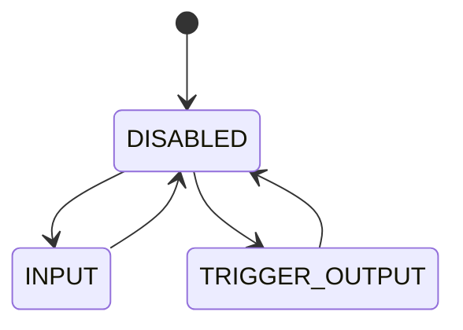

# State, Fault, Storage, And Observability

---

## Session State Machine

Rules:

- `READY` requires valid config, mounted storage, and no blocking fault
- `STARTING -> RECORDING` additionally requires `all_required_ready = true` from `sensor_manager`
- `FAULTED` may be recoverable depending on cause
- `READY` is the operator-visible idle state for revision 1
- the design does not require a separate persistent `ARMED` session state; start gating is performed inside `STARTING`

## Health Classification

Session lifecycle and health are modeled separately.

Health states:

- `HEALTHY`
- `DEGRADED`
- `UNAVAILABLE`

Rules:

- `DEGRADED` may coexist with `READY` or `RECORDING` when the device is still operating but one or more guarantees have been compromised
- `UNAVAILABLE` means authoritative recording or trusted session control is no longer defensible and usually coincides with `FAULTED`
- degraded health must be latched visibly in counters, status output, and binary fault/status records whenever the binary path is still writable

---

## Per-Port SYNC Mode State

Rule:

- no direct `INPUT` to `TRIGGER_OUTPUT` transition is allowed during active recording without explicit reconfiguration policy

---

## Fault Classes

- `CONFIG_INVALID`
- `UART_OVERFLOW`
- `UART_BUFFER_EXHAUSTED`
- `SYNC_QUEUE_OVERFLOW`
- `TRIGGER_SCHEDULE_ERROR`
- `SENSOR_PROBE_FAILED`
- `SENSOR_CONFIG_FAILED`
- `SENSOR_READY_TIMEOUT`
- `BINARY_PIPELINE_OVERFLOW`
- `STATUS_PIPELINE_OVERFLOW`
- `SD_MOUNT_FAILURE`
- `SD_WRITE_FAILURE`
- `SD_SYNC_FAILURE`
- `INTERNAL_ASSERTION`

---

## Fault Severity

- `INFO`
- `WARN`
- `ERROR`
- `FATAL`

---

## Fault Handling Rules

- `WARN` does not change session state directly
- `ERROR` may preserve ongoing recording while surfacing degraded health
- `FATAL` transitions session state to `FAULTED` or halts healthy-recording claims immediately
- any fault indicating raw data loss must always be represented in both counters and logged events

---

## Storage And File Contracts

### Session Files

Each session creates:

- one authoritative binary file
- one human-readable status file

### Binary File Contract

The binary file must:

- begin with a versioned file header
- contain complete length-delimited records
- preserve append order
- support detection of unclean termination

### Flush Policy

Flush policy goals:

- bound data-at-risk in RAM
- avoid pathological sync frequency
- preserve throughput headroom

Recommended contract:

- flush staged binary data on buffer-full, stop request, and periodic integrity checkpoints
- perform explicit storage sync at bounded intervals appropriate for the media

---

## Observability Contracts

Required metrics:

- per-port RX bytes
- per-port overflow count
- per-port dropped-event count
- per-port sensor lifecycle state
- per-port sensor initialization duration
- binary pipeline fill level
- status pipeline fill level
- SD write latency histogram or max
- session duration
- trigger count per output port
- SYNC event count per input port

Metrics consumers:

- `health_monitor`
- console status commands
- human-readable status log
